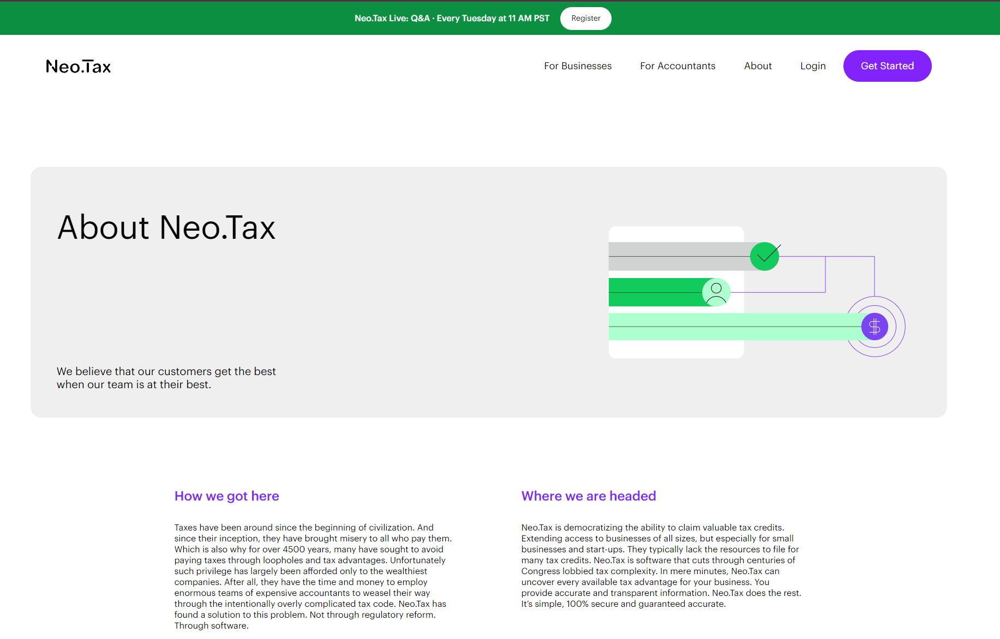
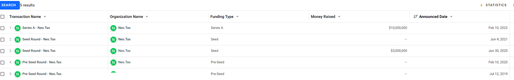

https://www.crunchbase.com/organization/neo-tax

Neo.Tax is building the easiest and most accurate tax filing and automation software. Their first product simplifies the complex process of applying for the IRS R&D Tax Credit, putting up to $250,000 back into each company's pocket. The first step towards turning a small business’ taxes into a modern advantage. Neo.Tax’s approach isreflected in their founding team; a Stanford PhD in Machine Learning automating the brain of a former IRS Agent, productized by a former Intuit product manager.

