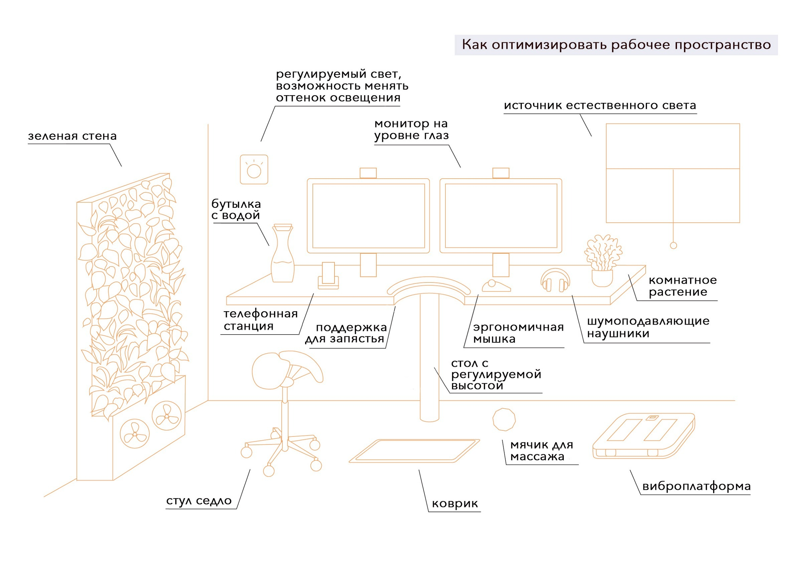
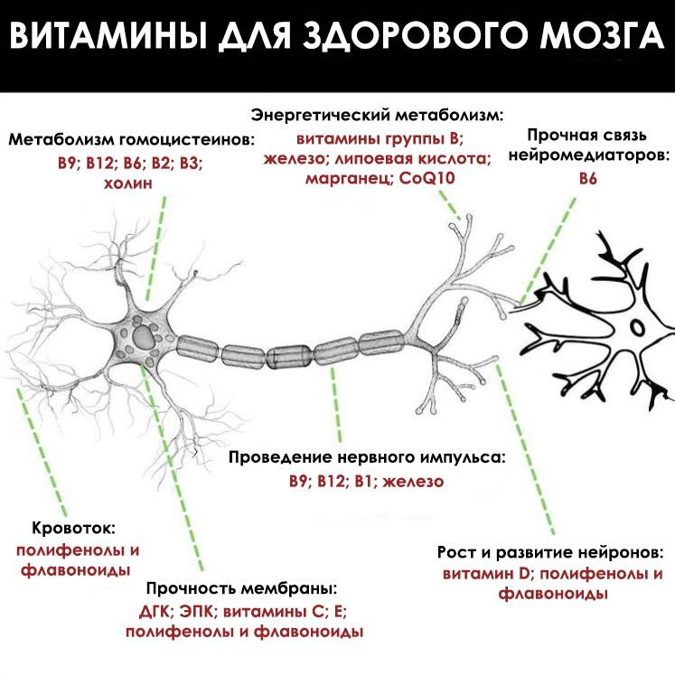

# Содержание

1. Создание концепта
2. Создание свода правил, регулирующих взаимодействие субъектов внутри проекта.
3. Доказательная база

# Создание концепта

Основополагающими приницпами проекта являются:

* Научность
* Продуктивность
* Ответственность за результат лежит на исполнителе

Присутствует закрытая территория, оснащенная необходимым для работы и поддержания здоровья имуществом.

# Создание свода правил

## Нейрофидбек

## Рабочее место

1. Стол с регулируемой высотой, чтобы можно было работать за ним как сидя на стуле-седле, так и стоя.
2. Стул-седло с разделенным сидением, чтобы сохранить здоровье репродуктивной системы и не только.
3. Мониторы компьютера на уровне глаз, чтобы позвоночник не искривлялся, сильно наклоняясь вперед.
4. Коврик подходящий для работы стоя (можно заземляющий или против усталости «anti-fatigue mat»). На таком коврике проще стоять долгое время, он мягкий, поэтому тело постоянно совершает микродвижения, чтобы сохранять баланс, уменьшается нагрузка на нижнюю часть позвоночника и меньше устают ноги. На нем можно стоять как босиком, так и в ботинках.
5. Мячик для массажа ног.
6. Виброплатформа, на которую можно периодически вставать, чтобы улучшалась циркуляция крови и лимфы.
7. Шумоподавляющие наушники, которые защитят от шумовых загрязнений, они помогут уменьшить стресс и улучшить концентрацию.
8. Бутылка с водой, чтобы не происходило обезвоживание, которое может провоцировать головные боли.
9. Комнатные растения и/или зеленая стена для улучшения качества воздуха.
10. Окно, как источник естественного света и кислорода, которые нам необходимы для здоровья.
11. Регулируемый свет. После захода солнца лучше избегать синего спектра света, чтобы не нарушалась выработка мелатонина и не страдало качество сна.

## Витамины, питание, т.д.

рекомендуется придерживаться такого питания, которое обеспечит постоянное снабжение организма жизненно важными витаминами и минералами для поддержки когнитивных процессов и общего здоровья мозга.

## Чем питаться для повышения когнитивных функций

**Про жиры**

Если в вашем рационе много **поврежденных** жирных кислот, таких как кукурузное, сафлоровое, подсолнечное масло и масло канолы, или вы едите много трансжиров, или рыбий жир, который вы принимаете, испорчен и подвергается воздействию света и тепла, или стейк, который вы едите, ненатурального происхождения, тогда эти поврежденные жиры — то, что включается в строительные блоки ваших драгоценных клеточных мембран. А ваш мозг и нервная система состоят из продуктов, которые вы едите.
Эти поврежденные, высокореактивные жиры присутствую в большинстве брендов картофельных чипсов, картофеля фри, жареных упакованных продуктов и практически любой другой пищи с жиром, которая нагревается до слишком высокой температуры, чтобы жиры оставались стабильными (или подвергается воздействию слишком высокого давления, что разрушает естественную структуру жиров). Типичный пример — оливковое масло, нагретое до температуры выше 204`С и обжаренное несколько раз.

Хотя богатое флавонолами оливковое масло первого отжима отлично подходит для употребления в пищу. Тем не менее, вы можете найти поврежденное оливковое масло во многих высококлассных ресторанах, даже не подозревая об этом, или разбавленное пополам с маслом канолы для экономии денег. После употребления такой пищи, ваши клеточные мембраны получают эти жиры и оборачивают ими остальную часть клетки.
Ни один другой орган не подтверждает правило “ты то, что ты ешь” лучше, чем мозг. Обильное количество жира содержится в мембранах клеток мозга и нейронах. Эти жиры изолируют ваш мозг, защищают его от ударов и помогают нервной системе поддерживать здоровую температуру. Передача электрических сигналов через синапсы нейронов также зависит от жирных кислот, как и уровни нейротрансмиттеров, которые контролируют настроение и сон. Эти жиры, как и все другие клеточные липиды в вашем теле, также состоят из жиров, получаемых с пищей.

Именно поэтому можно сказать, что сахар — меньшее зло, чем любая популярная жареная пища. Сахар не станет строительным материалом для вашего тела. Конечно, сахар может поднять уровень глюкозы в крови, вызвать воспаление в сосудах, вызвать вздутие живота и большой выброс инсулина. Но, по крайней мере, вы можете отправиться на пробежку или употребить немного экстракта горькой дыни, цейлонскую корицу, чтобы снизить уровень сахара и сократить ущерб для организма. Однако вы не можете сделать это с “плохими жирами” — они будут включаться в ваши клеточные мембраны, независимо от того, тренируетесь вы или нет, и нет никакого способа исправить ущерб.
Но тот факт, что ваше тело и мозг построены из жиров, которые вы едите, не единственный повод быть осторожными с поврежденными жирами. Есть и ещё одна причина, по которой диета, включающая такие жиры, не приносит вам никакой пользы — это воспаление. Воспаление является частью естественной реакции организма на инфекцию и повреждение тканей (и даже полезно для роста мышц после упражнений), но хроническое воспаление может привести к ряду серьезных заболеваний, от ожирения и потери мышц до атеросклероза и артрита. По мнению многих диетологов и научных исследований, сахар — самый воспалительный продукт. Но сахар, хотя и вызывает воспаление, не так ужасен, как обработанные масла.

*Обработанные масла (в том числе растительные и масло канолы) широко распространены. Большинство из них можно классифицировать как полиненасыщенные жиры, которые нестабильны и склонны к окислительному повреждению — опасному для ваших клеток, включая нейроны в мозге.*

Окислители, которые являются агентами переноса электронов в организме, вполне естественны и являются побочными продуктами нормальных метаболических процессов в клетках. Но когда они распространяются по вашему телу, то вызывают воспаление и обширное повреждение ДНК, белков и липидов, что может привести к сердечно-сосудистым заболеваниям, дефициту иммунной системы и, что неудивительно, дисфункции мозга.

*Таким образом, первый шаг в любой стратегии подпитки мозга должен начинаться с устранения всех источников перегретых, находящихся под избыточным давлением растительных масел и полиненасыщенных жиров и замены их здоровыми жирами и “хорошим” холестерином. Которые, в отличие от обработанных масел, являются одними из лучших источников топлива для мозга и совершенно естественной пищей для человека.*

**Что не стоит есть и почему**

1. Продукты с высоким содержанием гистамина

Гистамины — это соединения, выделяемые лейкоцитами, которые также называют «тучными клетками». Они — часть иммунного ответа на стрессоры, такие как порезы, царапины и аллергены. После высвобождения они расширяют кровеносные капилляры и увеличивают приток крови к участкам, подвергшимся стрессу (например, к носовой полости в сезон аллергии), что приводит к воспалению.
Проблема в том, что избыток гистамина также может вызывать головные боли и помутнение сознания. Например, системный мастоцитоз — это заболевание тучных клеток, связанное с такими психиатрическими проявлениями, как снижение внимания и памяти, склонность к гневу, раздражительность и депрессия. Всё это вызвано увеличением воспаления в головном мозге под действием гистаминов. В то время как низкие уровни гистаминов необходимы для функционирования мозга, двигательной активности, правильных циркадных ритмов и многого другого, чрезмерные уровни вызывают переключение отдельных частей мозга в режим воспалительного ответа.
Один из способов борьбы с избытком гистамина в головном мозге, особенно если вы чувствительны к нему — это избегать чрезмерного потребления продуктов, содержащих большое количество данного вещества:
• Ферментированные напитки, такие как вино, пиво и чайный гриб;
• Квашеная капуста, уксус, соевый соус, кефир и йогурт;
• Пропитанные уксусом продукты, например, соленые огурцы и оливки;
• Вяленое или копчёное мясо, такое как бекон, салями, хот-доги и копченая рыба;
• Кислые продукты, такие как сметана, простокваша;
• Сухофрукты;
• Выдержанные сыры;
• Арахис.
Речь не идёт о полном исключении данных продуктов, но если они составляют основу вашего рациона, то могут вызвать высокий и неконтролируемый уровень гистамина.
Основные продукты питания, которые содержат меньшее количество гистаминов:
• Свежеприготовленное (не копчёное, вяленое или консервированное) мясо, рыба и птица;
• Зёрна с низким содержанием глютена, такие как амарант, гречка, рис (коричневый, белый, дикий), просо, киноа, сорго, теф;
• Свежие фрукты, такие как манго, груша, арбуз, яблоко, киви, дыня, виноград;
• Свежие овощи вместо консервированных;
• Оливковое масло первого холодного отжима и кокосовое масло;
• Листовые травы, такие как петрушка и кинза, а также травяные чаи.

2. Пища, вызывающая колебания уровня глюкозы

В нашем мозге есть клетки, называемые микроглия и астроциты. Когда эти клетки стимулируются сахаром в качестве основного источника топлива, наряду с частыми колебаниями уровня глюкозы в крови, они могут вызывать хроническое нейровоспаление, которое приводит к потере нейронов и прогрессированию деменции и болезни Альцгеймера.
Ещё одно состояние, которое может возникнуть из-за резкого колебания уровня глюкозы, — это гиперинсулинемия, которая в свою очередь вызывает гипогликемию и нейрогликопению (нехватку глюкозы в мозге, которая влияет на функцию нейронов) и, в конечном итоге, повреждение мозга. Прямо противоположный эффект достигается с помощью низкоуглеводной диеты с высоким содержанием жиров, интервального голодания и кето-диеты — всё это улучшает передачу сигналов инсулина и снижает побочные эффекты, связанные со скачками сахара в крови.
Фактически, одно исследование показало, что всего через шесть месяцев кето-диеты, ограничивающей колебания уровня сахара в крови, у одного пациента с диагнозом врожденный гиперинсулинизм не наблюдался эпилептический кризис, и он продемонстрировал заметное улучшение психологического развития.
Если вы очень активный человек, вам всё равно нужно некоторое количество углеводов для запасов гликогена в печени и мышцах, суставах и других тканях, которым требуется определённое количество сахара. Но даже в этом случае следует употреблять углеводы «до», «во время» или «после» физической активности, тогда они с гораздо меньшей вероятностью вызовут резкие колебания уровня глюкозы.

3. Тяжёлые металлы

Алюминий, мышьяк, свинец, литий, марганец и таллий также нейротоксичны и негативно влияют на когнитивные функции. Например, свинец подавляет синтез гема (гем является небелковой частью гемоглобина — молекулы, которая переносит кислород в крови), также может влиять на функцию мозга, вмешиваясь в нейротрансмиттеры. А метилртуть повреждает определённые области в мозге взрослого человека.
Существует много способов вывести токсины из организма, в том числе употребление древесного угля и водорослей, таких как хлорелла. Но если вы решите вывести металлы из своего тела и не будете делать это с помощью правильных методов, то можете получить тот же урон, что и шляпники. Почему? Дело в том, что простое употребление большого количества древесного угля, хлореллы или любой другой популярной добавки для детоксикации может быть опасным, потому что эти продукты известны как «слабо связующие вещества» — это означает, что вместо того, чтобы удалять токсины, они просто взбалтывают их, позволяя проникать в более глубокие ткани, особенно в мозг.
Но использование настоящего связывающего агента (или агентов) в правильно структурированном протоколе детоксикации имеет решающее значение для предотвращения рециркуляции токсинов, таких как металлы, после того, как они вышли из клетки. И, конечно, следует быть осторожными и избегать продуктов с высоким содержанием тяжёлых металлов, в том числе:
• Особо крупная или хищная рыба, такая как королевская макрель, большеглазый тунец, акула и рыба-меч (ртуть);
• Переработанный или измельчённый костный бульон из неорганических источников (свинец);
• Большое количество коричневого риса (мышьяка);
• Мука пшеничная рафинированная (кадмий);
• Безалкогольные напитки из автоматов (в трубках автомата может быть кадмий);
• Консервы (свинец).

4. Липополисахариды (LPS)

Вообще говоря, эндотоксин — это «любой метаболит или компонент клеточной стенки, выделяемый кишечными бактериями, который нарушает физиологию человека». Липополисахариды, также известные как липогликаны, представляют собой большие молекулы, обнаруженные во внешней мембране грамотрицательных бактерий. Их составляют липиды и полисахариды, состоящие из О-антигена, внешнее и внутреннее ядро, соединенные ковалентной связью.
Что наиболее важно, LPS определенно классифицируются в исследованиях как эндотоксины. От 25% до 33% малых молекул в крови человека происходят из кишечных бактерий и включают LPS. Когда уровень эндотоксинов в крови становится слишком высоким, возникает метаболическая эндотоксемия, которая связана со многими неблагоприятными состояниями, включая сердечно-сосудистые заболевания, хроническое воспаление, диабет 2-го типа, дислипидемию, инсулинорезистентность, неалкогольную жировую болезнь печени, ожирение и т.д. Интересно, что одним из факторов, способствующих более высокому риску метаболической эндотоксемии, вызванной LPS, является диета с высоким содержанием жиров.
Но разве жиры не полезны для нервной системы? Да, но дело в том, что диеты с высоким содержанием жиров также могут вызвать эндотоксемию. Проблемы, которые сопровождают потребление большого количества жиров, возникают тогда, когда вы употребляете большое количество жиров вместе с большим количеством углеводов — картофельные чипсы, свиная кожура, чизкейк, запечённые лакомства, рибай — стейк с шоколадным суфле и подобное.
Эндотоксемия также связана с системным воспалением, потому что одним из основных факторов, участвующих в этом типе воспаления всего тела, является повышение проницаемости кишечного барьера. Когда проницаемость кишечного барьера увеличивается, что позволяет большему количеству частиц попасть в вашу кровеносную систему, включая LPS. Это означает, что любой подход к снижению уровня циркулирующих эндотоксинов должен включать в себя стратегии по снижению уровня воспаления в кишечнике, и стоит также делать упор на снижение колебаний глюкозы, особенно если вы придерживаетесь диеты с высоким содержанием жиров.

5. «Умные» лекарства

«Умное лекарство» — это прописанное или используемое не по инструкции лекарство для лечения какого-либо психического или когнитивного расстройства. Обратите внимание, что существуют явные различия между синтетическими «умными» лекарствами и «ноотропами» на основе трав или натуральных пищевых продуктов, такими как гриб Львиная грива, Гинко билоба или бакопа Моньери. Например, синтетическое химическое вещество Аддерал (декстроамфетамин) является одним из самых популярных умных лекарств, а за ним следуют такие препараты как модафинил и риталин.
Препараты класса стимуляторов, как правило, вызывают всплески дофамина и норадреналина, что приводит к толерантности и формированию привычки. Толерантность особенно опасна, потому что по мере того, как вы становитесь более толерантными к препарату, вам нужно больше, чтобы заметить его эффекты. Это, в свою очередь, отрицательно сказывается на аппетите, стабильности настроения и уровне стресса. С другой стороны, настоящие ноотропы, как правило, не приводят к толерантности или формированию привычек, истощению нейромедиаторов или нарушению когнитивной функции. Ноотропный пирацетам, открытый в 1960-х годах, и его родственники, такие как оксирацетам и нефирацетам, могут даже обратить вспять амнезию, вызванную электросудорожным шоком и гипоксией, и снизить силу деменции.
Общее эмпирическое правило состоит в том, что если что-то сильно «ощущается» от дозы к дозе и вызывает опьяняющее чувство, сковывающий или седативный эффект — это умное лекарство или усилитель производительности, но не ноотроп. Ноотропы устойчивы, в то время как эти типы препаратов нет. Однако, если у вас есть рецепт (или вы принимаете без такового) на Аддерал или аналогичный стимулятор, очень важно быть осторожным, чтобы не допустить передозировки. Умные лекарства не поддерживают естественные когнитивные процессы, они могут быть токсичными, угнетать или чрезмерно стимулировать мозг, а также вызывать побочные эффекты, подобные упомянутым выше (вплоть до летального исхода).

**Соединения, которые поддержат работу вашего кишечника и мозга**

Конъюгированная линолевая кислота (CLA)

CLA — это жирная кислота, которая обладает способностью позитивно модулировать иммунные и воспалительные реакции, а также может быть полезной для защиты мозга. В высоких концентрациях она содержится в мясе и молочных продуктах жвачных животных, в том числе крупного рогатого скота и овец. Простой способ увеличить потребление CLA — включить в свой рацион говядину, баранину и необработанные молочные продукты этих животных.
Масляная кислота
Масляная кислота, часто называемая бутиратом, представляет собой жирную кислоту, содержащуюся в молоке, масле (отсюда и название) и сыре как продукт ферментации углеводов в толстой кишке. Она действует как противовоспалительное средство, ингибируя активацию NF-κB (транскрипционный фактор NF-κB) в эпителиальных клетках толстой кишки. NF-κB регулирует гены, участвующие в иммунных воспалительных реакциях, поэтому, подавляя вызванное диетой или микробиотой воспаление, бутират помогает свести к минимуму влияние воспаления на центральную нервную систему. Как и в случае с CLA, вы можете получить больше бутирата, употребляя масло и другие молочные продукты от скота травяного откорма.

Глутатион (GSH)

GSH — это трипептид, состоящий из цистеина, глицина и глутаминовой кислоты, который вырабатывается и обнаруживается в высоких концентрациях в большинстве клеток вашего тела. Он играет важную роль в защите клеток и клеточных молекул от окислителей, которые образуются как внутри, так и вне организма, и способствует выведению токсинов из клеток. Глутатион также помогает регенерировать другие антиоксиданты в организме, такие как токоферолы и аскорбаты. Но даже если ваше тело вырабатывает GSH естественным образом, поддержание производства требует адекватного потребления белка. И один из способов убедиться, что вы получаете достаточно GSH — это включить в свой рацион необходимое количество белка (в диапазоне 1–1,6 г. / кг.).
Вы также можете принимать добавки GSH. Было показано, что добавки GSH работают не только как антиоксидант, но также оказывают антиэйдж воздействие и улучшают состояние кожи. Однако помимо кожи наибольшее поглощение дополнительного GSH происходит в почках, сердце, лёгких, тонком кишечнике и, что особенно важно, в головном мозге.
Чтобы увеличить уровни глутатиона, необходимо потреблять продукты, содержащие прекурсоры GSH, в том числе расторопшу, качественные сывороточные белки, рукколу, брокколи, цветную и кудрявую капусту. Также полезны будут авокадо, чечевица, печень, бобы гарбанзо, бразильские орехи, шпинат и говядина травяного откорма. Кроме того, вы можете пополнить свои запасы GSH с помощью сублингвального, инъекционного и внутривенного введения глутатиона или добавок.

Древесный уголь

Хотя данная методика не достаточно подтверждена серьёзными научными исследованиями, существует мнение, что добавки, богатые углеродом, уменьшают нейронное окисление и улучшают работу мозга. И один из самых простых и удобных источников углерода — это активированный уголь.
Человеческое тело построено из многих химических элементов, но основным строительным блоком большинства клеток тела является углерод. Углерод составляет около 18% от общей массы тела. Считается, что воздействие древесного угля и дыма (оба из которых наполнены углеродом) в период развития человека как охотника — собирателя — это то, что способствовало более высокому когнитивному развитию.
Активированный уголь — это древесный уголь, прошедший тепловую обработку, чтобы повысить его способность впитывать токсины. В некоторых случаях его можно использовать для поглощения ядов, попадающих в пищеварительную систему. Активированный уголь также поддерживает здоровье мозга, нейтрализуя токсины и тяжёлые металлы, которые могут подавлять функцию мозга и приводить к таким вещам, как помутнение сознания, биполярное расстройство, депрессия или тревожное расстройство.

Докозагексаеновая кислота (DHA)

DHA (докозагексаеновая кислота) — это особый тип жирной кислоты омега-3, который особенно важен для роста головного мозга у младенцев. DHA также необходима взрослым для поддержания должного функционирования мозга и чрезвычайно распространена в нервной системе и нервных тканях. Дефицит DHA связан с синдромом дефицита внимания и гиперактивностью, кистозным фиброзом, фенилкетонурией, униполярной депрессией, агрессивностью и адренолейкодистрофией.
В одном исследовании наблюдалось влияние добавок DHA на память и время реакции молодых людей, которые не потребляли достаточного количества омега — 3 жирных кислот. Было обнаружено, что приём добавки действительно улучшал как эпизодическую память женщин, так и рабочая память мужчин. Другое исследование показало, что DHA предотвращает усиление агрессивности у молодых студентов во время психического стресса.
Наполнять свой рацион DHA несложно. Это один из основных компонентов многих видов моллюсков и рыб, таких как анчоусы, лосось, сельдь, скумбрия, тунец и палтус. Таким образом, для получения достаточного количества DHA вы можете либо увеличить потребление морепродуктов, либо использовать высококачественный свежий неокисленный рыбий жир — либо и то, и другое. DHA также легко доступна в яйцах и говядине травяного откорма.
Даже если вы придерживаетесь веганской или вегетарианской диеты, вы всё равно можете получать DHA, но это требует немного больше усилий и затрат. Некоторые водоросли, такие как спирулина и хлорелла, содержат большое количество альтернативной формы, известной как DHEA. Возможно, вы слышали, что орехи и семена (льна, конопли, чиа) также являются источниками DHA, но правда в том, что способность вашего тела разблокировать эти запасы и преобразовать их в пригодную для использования DHA довольно низка. Однако семена, орехи и даже некоторые растения, такие как брюссельская капуста, богаты омега — 3 жирными кислотами, называемыми короткоцепочечными жирными кислотами, особенно альфа-линоленовой кислотой (ALA). Хотя короткоцепочечные омега — 3 менее эффективны, чем DHA, они действуют как нейропротекторы и по-прежнему полезны для здоровья ваших клеток и мозга.